# Computer Architecture 2024 Gem 5 - Exercise
## Μέρος Πρώτο
   <a name=p1.q1></a> 
   1. Για το παράδειγμα του Hello World, χρησιμοποιήσαμε το αρχείο **starter_se.py** το οποίο βοηθάει στην διαμόρφωση ενός συστήματος για την εξομοίωση ενός προγράμματος πάνω σε αυτό. Από αυτό το αρχείο και σε συνδυασμό με την εντολή που χρησιμοποιήσαμε 

      > ./build/ARM/gem5.opt -d hello_result configs/example/arm/starter_se.py --cpu="minor" "tests/test-progs/hello/bin/arm/linux/hello"  

      και συγκεκριμένα το flag **--cpu="minor"** διαπιστώνουμε ότι ο επεξεργαστής που θα χρησιμοποιηθεί είναι τύπου **minor** ,δηλαδή ένα απλός επεξεργαστής που εκτελεί τις εντολές με την σειρά που εμφανίζονται (_in-order execution_), ενώ υπάρχουν και άλλοι τύποι διαθέσιμοι. Επίσης παρατηρούμε ότι ο επεξεργαστής θα έχει μόνο **1 πυρήνα** και η συχνότητα λειτουργίας ορίζεται στο **1GHZ**, αφού δεν χρησιμοποιούμε τα αντίστοιχα flag. Όσο αναφορά τις **caches**, το αρχείο θέτει μέγεθος γραμμής της ίσο με **64 bytes** και δύο επίπεδα **L1** και **L2**. Καθώς δεν χρησιμοποιούμε κάποια flags σχετικά με την **μνήμη** ορίζονται οι προεπιλεγμένες τιμές, δηλαδή **DDR3 1600 MHz**, **2 κανάλια** και μέγεθος **2 Gb**. Ακόμα, στο αρχείο δημιουργείται ένας δίαυλος επικοινωνίας εκτός τσιπ, συνδέεται με την θύρα του συστήματος για το φόρτωμα του **_kernel_**, ορίζονται τα **όρια** της μνήμης. Επίσης, υπάρχουν συναρτήσεις που διαχειρίζονται τις εντολές που θα "_τρέξουν_" και που διαχειρίζονται την διαμόρφωση της μνήμης. Τέλος το αρχείο αρχικοποιεί την εξομοίωση και την ξεκινάει.
<a name=p1.q2></a> 
2. Στο τέλος της εξομοίωσης δημιουργείται ένας φάκελος με τα αρχεία που παράγει ο gem5. Τετοια αρχεία είναι το **stats.txt** και τα **config**. Το πρώτο περιέχει όλες τις πληροφορίες σχετικά με την **εξομοίωση** και την **λειτουργία** του συστήματος, όπως κύκλους ρολογιού, προσπελάσεις μνήμεις κτλπ. Τα config αρχεία περιέχουν όλες τις πληροφορίες με την **διαμόρφωση** του συστήματος. Συγκεκριμένα, τα **config.ini** και **config.json** έχουν παρόμοιες πληροφορίες, απλά το 2ο τις αναπαριστά σε μορφή _json_. 
   * Αν παρατηρήσουμε αυτά τα αρχεία μπορούμε να επαληθεύσουμε τα στοιχεία που έιχε το αρχείο διαμόρφωσης **starter_se.py**.
        ### config.ini
        ```ini
        [system]
        cache_line_size=64
        mem_ranges=0:2147483647

        [system.clk_domain]
        type=SrcClockDomain
        clock=1000

        [system.cpu_cluster.cpus]
        type=MinorCPU
        
        [system.cpu_cluster.cpus.icache]
        type=Cache

        [system.cpu_cluster.cpus.dcache]
        type=Cache
        
        [system.cpu_cluster.l2]
        type=Cache
        
        [system.mem_ctrls0]
        type=DRAMCtrl
        range=0:2147483647:0:1048704

        [system.mem_ctrls1]
        type=DRAMCtrl
        range=0:2147483647:1:1048704 
        ```
    * Όπως αναφέρθηκε προηγουμένως το αρχείο **stats.txt** περιέχει πληροφορίες σχετικά με την εξομοίωση:  
     Το **sim_seconds** είναι ο **συνολικός χρόνος που πέρασε στην εξομοίωση** σε δευτερόλεπτα, δηλαδή ο χρόνος που θα έκανε το πρόγραμμα να τρέξει στον επεξεργαστή του εξομοιούμενου συστήματος.  
     Το **sim_insts** είναι ο **συνολικός αριθμός των εντολών** που εκτελέστηκαν κατά τη διάρκεια της εξομοίωσης, δηλαδή οι εντολές εκτελέστηκαν από τον επεξεργαστή του εξομοιούμενου συστήματος.  
     Το **host_inst_rate** είναι ο **ρυθμός εκτέλεσης εντολών** στον υπολογιστή που φιλοξενεί την εξομοίωση, μετρημένος σε εντολές ανά δευτερόλεπτο. Αυτή η μετρική δείχνει την απόδοση της εξομοίωσης σε σχέση με τον πραγματικό χρόνο.
     * Το συνολικό νούμερο των "_commited_" εντολών ειναι το 
       ```
       system.cpu_cluster.cpus.committedOps             5831 system.cpu_cluster.cpus.committedInsts           5027 
       ```  
       και είναι ίδιο με το sim_ops kai sim_insts αντίστοιχα που παρουσιάζει ο gem5. Βέβαια, μπορόυμε να βρούμε τα decoded instructions τα οπόια συνολικά είναι 8153, δηλαδή πολύ περισσότερα από όσα εκτελέστηκαν. Αυτό συμβαίνει διότι πολλές εντολές έγιναν fetch και decode λόγω branch prediction η και speculation αλλά δεν εκτελέστηκαν τελικά. Επίσης μπορεί να υπήρξαν conflicts στο pipeline η data dependencies και κάποιος εντολές να χρειάστηκε να γίνουν παραπάνω απο μια φορά decode και ακόμα κάποιες μπορεί να ηταν NOP.

     * H **L2 Cache** προσπελάστηκε συνολικά **474** φορές. Αυτό αναφέρεται στο stats.txt ως **system.cpu_cluster.l2.overall_accesses::total**. Θα μπορούσαμε να υπολογίσουμε τον αριθμό των προσπελάσεων της L2 Cache σύμφωνα με τα misses στην L1 Cache, αφού ο επεξεργαστής θα μπεί και θα ψάξει κάτι στην L2 Cache αν δεν το βρει στο επίπεδο της L1.
<a name=p1.q3></a>    
3. Σύμφωνα με την βιβλιογραφία του Gem5 υπάρχουν δίαφοροι τύποι επεξεργαστών. Συγκεκριμένα για του in-order execution επεξεργαστες:  
    * **SimpleCPU**: Ένα πολύ βασικό λειτουργικό μοντέλο επεξεργαστή για εξομοιώσεις που δεν χρειάζονται μεγάλη λεπτομέρεια. Χωρίζεται σε 3 κλάσεις:

      * **BaseSimpleCPU**:Μια βασική κλάση που δεν μπορεί να λειτουργήσει ανεξάρτητα. Διαχειρίζεται τη βασική αρχιτεκτονική κατάσταση και τις κοινές λειτουργίες για τα SimpleCPU μοντέλα, όπως interrupts, requests, handlers κλπ.

      * **AtomicSimpleCPU**: Χρησιμοποιεί ατομικές προσβάσεις μνήμης και υπολογίζει μέσο χρόνο πρόσβασης στην cache, παρέχοντας έναν γρήγορο και απλό προσομοιωτή που είναι κατάλληλος για λειτουργικές προσομοιώσεις.

      * **TimingSimpleCPU**: Προσθέτει χρονικές καθυστερήσεις για τις προσβάσεις μνήμης, επιτρέποντας μια πιο ρεαλιστική απεικόνιση χωρίς την πολυπλοκότητα μιας λεπτομερούς προσομοίωσης της μνήμης με τις απαραίτητες συναρτήσεις για την διαχείρισή της​.

    * **MinorCPU**: Ένα μοντέλο in-order CPU με πιο λεπτομερή δομή αγωγού (pipeline) σε σχέση με το SimpleCPU. Έχει μια προκαθορισμένη μορφή αγωγού και διαμορφώσιμες δομές δεδομένων και συμπεριφορές.  Περιλαμβάνει τέσσερα βασικά στάδια: Fetch1, Fetch2, Decode και Execute. Υποστηρίζει Branch Prediction. Σχεδιάστηκε για εφαρμογές που απαιτούν μια πιο λεπτομερή μελέτη συγκεκριμένων στοιχείων και συμπεριφορών στο pipeline, καθώς επιτρέπει με τον τρόπο που έχει σχεδιαστεί την προσομοίωση των εντολών σε αυτό. Παρέχει καλή ισορροπία ανάμεσα στην ταχύτητα προσομοίωσης και το επίπεδο λεπτομέρειας.
    * **HighPerformanceIn-orderCPU**: Ένα μοντέλο επεξεργαστή εν σειρά (in-order) σχεδιασμένο για την προσομοίωση σύγχρονων αρχιτεκτονικών Armv8-A. Το HPI δίνει έμφαση στην επίτευξη υψηλής απόδοσης, διατηρώντας έναν απλό αγωγό εκτέλεσης εν σειρά. Περιλαμβάνει χαρακτηριστικά όπως μηχανισμό πρόβλεψης διακλαδώσεων (branch predictor), ιεραρχία μνήμης με υποστήριξη L1 και L2 cache, καθώς και μεταφραστική μνήμη (TLB) για τη βελτίωση της διαχείρισης διευθύνσεων. Ο επεξεργαστής αυτός είναι κατάλληλος για προσομοιώσεις σε System Call Emulation (SE) και Full System (FS) modes, προσφέροντας ένα ρεαλιστικό μοντέλο για μελέτες σύγχρονων επεξεργαστών Arm​

    * **InOrderCPU**: Ένα παλαιότερο μοντέλο που στοχεύει στη γενική προσομοίωση αγωγών εν σειρά με προσαρμόσιμα στάδια και μοντέλα πρόσβασης πόρων. Επιτρέπει στους ερευνητές να σχεδιάζουν και να προσομοιώνουν νέα δομικά στοιχεία αγωγών, καθιστώντας το χρήσιμο για πειραματισμούς, αν και δεν δίνεται τόσο μεγάλη έμφαση στις τελευταίες εκδόσεις του gem5  
<a name=p1.q3a></a>
   1. Γράφουμε ένα απλό πρόγραμμα που υλοποιεί την ακολουθία Fibonnaci:
      ```C
      include <stdio.h>

      int main(int argc, char* argv[]) {

      int n = 45; // Predefined number of terms
      int t1 = 0, t2 = 1, nextTerm = 0;

        for (int i = 2; i < n; ++i) {
            nextTerm = t1 + t2;
            t1 = t2;
            t2 = nextTerm;
        }

      // The last Fibonacci number is now in `nextTerm'
      printf("\n%d\n", nextTerm);


      return 0;
      }
      ```
      Το οποίο το κάνουμε compile για **ARM** επεξεργαστή μέσω της εντολής:
      >$ arm-linux-gnueabihf-gcc --static fibonacci.c -o fibonacci  

      και τρέχουμε τον gem5 με όρισμα το εκτελέσιμο αρχείο που παράχθηκε με την εντολή:
      >/build/ARM/gem5.opt -d fibonacci_TimingSimpleCPU_result configs/example/se.py --cpu-type=CPU --caches -c fibonacci/fibonacci

      όπου CPU, εκτελούμε μια φορά με **MinorCPU** και μια με **TimingSimpleCPU**.  
      Τα αποτελέσματα που παίρνουμε στο **stats.txt** που αφορούν τους χρόνους τόσο της εξομοίωσης όσο και του εξωμοιούμενου προγράμματος είναι τα εξής:  

      ### MinorCPU
      ```txt
      final_tick                                   34845000                       
      host_inst_rate                                 237780                      
      host_mem_usage                                 678752                       
      host_op_rate                                   270950                       
      host_seconds                                     0.04                      
      host_tick_rate                              904929149                       
      sim_freq                                1000000000000                       
      sim_insts                                        9138                       
      sim_ops                                         10430                       
      sim_seconds                                  0.000035                       
      sim_ticks                                    34845000
      ```
      ### TimingSimpleCPU
      ```txt
      final_tick                                   40247000                       
      host_inst_rate                                 756329                       
      host_mem_usage                                 674148                       
      host_op_rate                                   855122                      
      host_seconds                                     0.01                       
      host_tick_rate                             3330713528                       
      sim_freq                                1000000000000                       
      sim_insts                                        9085                       
      sim_ops                                         10323                       
      sim_seconds                                  0.000040                      
      sim_ticks                                    40247000
      ```
      <a name=p1.q3b></a>
   2. Όπως μπορούμε να παρατηρήσουμε από τα παραπάνω αποτελέσματα η διαδικασία **εξομοίωσης** του προγράμματος στον **host**
   διαρκεί περισσότερη ώρα στην περίπτωση του MinorCPU, σε σχέση με αυτή του TimingSimpleCPU το οποίο είναι λογικό αφού όπως αναφέραμε ο πρώτος είναι ένα πιο ρεαλιστικό και πιο **περίπλοκο** μοντέλο επεξεργαστή με περισσότερη υλοποιημένη **λογική** και **πολυπλοκότητα**.
   Παρόμοια είναι και η εξήγηση για την διαφορά του ρυθμού εντολών και διεργασιών που εκτελόυνται στον host σε κάθε εξομοίωση.
   Η χρήση της μνήμης στον host δεν διαφέρει κατα πολύ, αφού και στις δύο περιπτώσεις εξομοιώνουμε το ίδιο πρόγραμμα με τις ίδιες απαιτήσεις.
   Αντίθετα, παρατηρόυμε από τα στοιχεία που αφορόυν το εξομοιούμενο πρόγραμμα ότι στην περίπτωση του MinorCPU, ολοκληρώνεται **ταχύτερα** παρα το ότι εκτελεί περισσότερες εντολές με την ίδια συχνότητα. Η εξήγηση αυτού είναι ότι λόγω του πιο ρεαλιστικόυ μοντέλου του MinorCPU έχει περισσότερες εντολές απο το ιδανικό σενάριο του TimingSimpleCPU και επιπλέον έχει την δυνατότητα για pipelining που κάνει το πρόγραμμα ταχύτερο.
   <a name=p1.q3c></a>
   3. Παρατηρώντας το αρχείο **stats.txt** απο τις προηγούμενες προσομοιώσεις διαπιστώνουμε ότι το ρολόι των επεξεργαστών ήταν στα **2GHz**:
      ```
      system.cpu_clk_domain.clock                       500
      ```
      Επομένως θα τρέξουμε το ίδιο πρόγραμμα με διαφορετικό ρολόι για να δούμε πως θα το επηρεάσει. Επιλέγουμε ρολόι στα **3Ghz**. Συμφωνα με την βιβλιογραφία θα πρέπει να χρησιμοποιήσουμε στην εντολή που τρέχουμε, το flag:
      >--cpu-clock=3GHz  

      Δεν παρατηρόυμε κάποια σημαντική διαφόρα στα στοιχεία που προκύπτουν πέρα απο το χρόνο **sim_ticks** και επομένως **sim_seconds**:
      ### MinorCPU 3GHz
      ```
      sim_seconds                                  0.000033 (0.000035-2GHz)                       
      sim_ticks                                    33079554 (34845000-2GHz)
      ```

      ### TimingSimpleCPU 3GHz
      ```
      sim_seconds                                  0.000036 (0.000040-2GHz)                     
      sim_ticks                                    35699265 (40247000-2GHz)
      ```
      Σύμφωνα με τα παραπάνω δεδομένα μπορούμε να δούμε ότι η αύξηση της συχνότητας του ρολογιού προφανώς δεν έχει γραμμικό αντίκτυπο στον χρόνο του προγράμματος και επίσης διαφέρει σε κάθε μοντέλο, με μεγαλύτερη επίδραση στο δεύτερο και πιο απλό **TimingSimpleCPU**. Αυτό συμβαίνει επειδή το απλότερο μοντέλο είναι **ιδανικό** και δεν έχει ρεαλιστικές καθυστερήσεις στο pipelining και στην μνήμη επομένως η συχνότητα επιδρά πιο άμεσα στο συνολικό χρόνο εκτέλεσης.

      Παρατηρώντας το αρχείο **config.dot** από τις προηγούμενες προσομοιώσεις διαπιστώνουμε ότι ο τύπος της μνήμης ήταν **DDR3_1600_8x8**. Σύμφωνα με την βιβλιογραφία θα πρέπει να χρησιμοποιήσουμε στην εντολή που τρέχουμε, το flag:
      >--mem-type=DDR4_2400_16x4

      Επιλέγουμε αυτό τον τύπο επειδή σύμφωνα με την βιβλιογραφία έχει το μεγαλύτερο **bandwidth**.

      Αντίστοιχα με πριν παρατηρούμε διαφορά σε δύο κυρίως μετρικές:
      ### MinorCPU DDR4_2400_16x4
      ```
      sim_seconds                                  0.000034 (0.000035-2GHz)                      
      sim_ticks                                    34113000 (34845000-2GHz)
      ```

      ### TimingSimpleCPU DDR4_2400_16x4
      ```
      sim_seconds                                  0.000040 (0.000040-2GHz)                      
      sim_ticks                                    39874000 (40247000-2GHz)
      ```
      Στην περίπτωση με την μνήμη παρατηρούμε ότι η διαφορά που κάνει στο συγκεκριμένο πρόγραμμα είναι πολύ μικρή αλλά έχει μεγαλύτερη επίδραση στο μοντέλο του **MinorCPU**. Επειδή αυτό είναι πιο **ρεαλιστικό** στο κομμάτι της μνήμης και χρησιμοποιεί pipelining που επηρεάζεται από τις καθυστερήσεις μνήμης, η βελτίωση της έχει μεγαλύτερο αντίκτυπο. 

## Μέρος δεύτερο
### Βήμα πρώτο
<a name=p2.s1.q1></a>
1. Στο δεύτερο μέρος της εργασίας θα εκτελέσουμε τα διάφορα **benchmarks** με σκοπό να δούμε πως οι διάφοροι **παράμετροι** μπορύν να επηρεάσουν το χρόνο που κάνει ένα πρόγραμμα να τρέξει στον εξομοιούμενο επεξεργαστή. Για να το κάνουμε αυτό θα χρησιμοποιήσουμε πάλι το **script**:
   >configs/example/se.py

   Στην αρχή του **script** βλέπουμε της εξής γραμμές.
   ```python
   addToPath('../')

   from common import Options
   from common import Simulation
   from common import CacheConfig
   from common import CpuConfig
   from common import ObjectList
   from common import MemConfig
   from common.FileSystemConfig import config_filesystem
   from common.Caches import *
   from common.cpu2000 import *
   ```
   Σύμφωνα με αυτό, το συγκεκριμένο **script** κάνει import τα παραπάνω αρχεία που βρίσκονται στο φάκελο **common**, ο οποίος είναι ενα directory πίσω.
   Ανοίγοντας τα παραπάνω αρχεία διαπιστώνουμε ότι μπορούμε να βρούμε πολλές πληροφορίες στο αρχείο **Options**, στο οποίο επεξργάζονται τα **arguments** που βάζουμε όταν καλούμε το **script**.
   Για να εξομοιώσουμε τα benchmark προγράμματα με την βοήθεια του gem5, χρησιμοποιούμε την εντολή:  
   >./build/ARM/gem5.opt -d spec_results/specbzip configs/example/se.py --cputype=MinorCPU --caches --l2cache -c spec_cpu2006/401.bzip2/src/specbzip -o "spec_cpu2006/401.bzip2/data/input.program 10" -I 100000000
   
   όπου όπως βλέπουμε τα **flag** που χρησιμοποιούμε είναι τα:
   >--cputype=MinorCPU --caches --l2cache

   Όσο αναφορά τον επεξεργαστή, θα είναι τύπου **MinorCPU** με συχνότητα την default τιμή στα **2GHz**.
   Για τις caches απο το αρχείο **options** παρατηρούμε.
   ```python
       # Cache Options
    parser.add_option("--external-memory-system", type="string",
                      help="use external ports of this port_type for caches")
    parser.add_option("--tlm-memory", type="string",
                      help="use external port for SystemC TLM cosimulation")
    parser.add_option("--caches", action="store_true")
    parser.add_option("--l2cache", action="store_true")
    parser.add_option("--num-dirs", type="int", default=1)
    parser.add_option("--num-l2caches", type="int", default=1)
    parser.add_option("--num-l3caches", type="int", default=1)
    parser.add_option("--l1d_size", type="string", default="64kB")
    parser.add_option("--l1i_size", type="string", default="32kB")
    parser.add_option("--l2_size", type="string", default="2MB")
    parser.add_option("--l3_size", type="string", default="16MB")
    parser.add_option("--l1d_assoc", type="int", default=2)
    parser.add_option("--l1i_assoc", type="int", default=2)
    parser.add_option("--l2_assoc", type="int", default=8)
    parser.add_option("--l3_assoc", type="int", default=16)
    parser.add_option("--cacheline_size", type="int", default=64)
    ```
    Αρχικά τα arguments που τοποθετούμε είναι για δηλώσουμε ότι θέλουμε να ενεργοποιήσουμε την προσομοίωση των **L1** και **L2** **Caches**. Εφόσον όμως δεν ορίζουμε άλλες παραμέτρους για εκείνες, τότε θα έχουν τις **default** τιμές τους.
    Συγκεκριμένα:
    ```
    L1 Instruction Cache size                      32kB
    L1 Data Cache size                             64kB
    L2 Cache size                                  2MB
    L1 Instruction Cache associativity             2
    L1 Data Cache associativity                    2
    L2 Cache associativity                         8
    Cacheline size                                 64
    ```
    <a name=p2.s1.q2></a>
2. Αφού τρέξουμε τα διάφορα Benchmark με τις **default** ρυθμίσεις παίρνουμε τα παρακάτω αποτελέσματα.
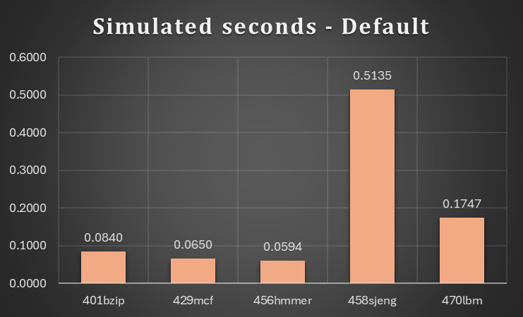  
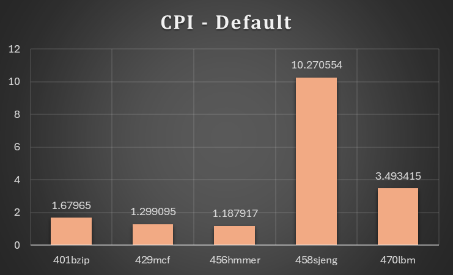
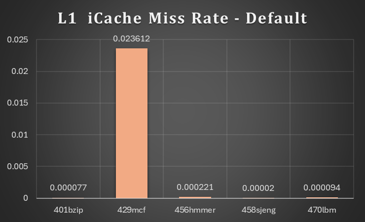

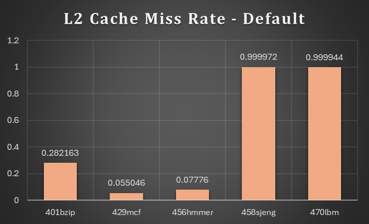
   
   Το πρώτο πράγμα που παρατηρούμε είναι ότι ο ίδιος επεξεργαστής μπορεί να έχει πολύ διαφορετική επίδοση αναλόγως το πρόγραμμα που τρέχει. Επίσης το **458sjeng** benchmark έχει υψηλο **CPI**, **L1** **dCache** **Miss** **Rate** και **L2** **Cache** **Miss** **Rate** σε σχέση με τα υπόλοιπα. Το συγκεκριμένο προσομοιώνει μια **μηχανή** **σκακιού** η οποία πρέπει να ελέγξει πολλές κινήσεις και έχει μεγάλα δέντρα αναζήτησης. Αυτό επηρεάζει πολύ την τοπικότητα επομένως πρέπει συχνά ο επεξεργαστής να επιστρέψει στην μνήμη για να φέρει την πληροφορία καθυστερώντας τον και αυξάνοντας τα miss rate.
   Επίσης παρατηρούμε ότι το benchmark **429mcf** έχει σημαντικά μεγαλύτερο **L1** **iCache** **Miss** **Rate**, το οποίο είναι ένα πρόβλημα **συνδυαστικής** **βελτιστοποίησης**. Το πρόγραμμα αυτό έχει τοπικότητα απλά το μέγεθος τον δεδομένων ξεπερνάει το μέγεθος της L1 Cache με αποτέλεσμα να αυξάνεται το Miss Rate. Τέλος, παρατηρούμε ότι και **470lbm** benchmark έχει πολύ μεγάλο L2 Cache Miss Rate, το οποίο είναι ένα πρόγραμμα που υπολογίζει την **δυναμική** **ρευστών**. Όπως είναι προφανές αυτό απαιτεί μεγάλες δομές δεδομένων που ξεπερνούν το μέγεθος της Cache.
   <a name=p2.s1.q3></a>
3. Εκτελούμε τα benchmarks για ρολόι **1GHz** και **3GHz**. Βλέποντας το αρχείο **stats.txt** για την δέυτερη εξομοίωση παρατηρούμε τα δύο παρακάτω στοιχεία:
   >system.clk_domain.clock                          1000  

   >system.cpu_clk_domain.clock                       333

   Το πρώτο αντιπροσωπεύει τη συχνότητα ρολογιού του όλου συστήματος (**system** **clock**), ενώ το δέυτερο τη συχνότητα ρολογιού που εφαρμόζεται στους επεξεργαστές (**CPU** **cluster** **clock**). Βλέποντας και τα υπόλοιπα αρχεία διαπιστώνουμε ότι αυτό συμβαίνει επειδή το απαιτεί η αρχιτεκτονική του επεξεργαστή, δηλαδή ότι μπορεί να έχει άλλες μονάδες που δεν ακολουθούν την συχνότητα του επεξεργαστή. Επομένως αν προσθέσουμε ακόμα έναν επεξεργαστή η συχνότητα του θα πρέπει να είναι ίδια με του πρώτου αφου δεν ορίζουμε κάπου ξεχωριστή συχνότητα για τον δέυτερο. Οι χρόνοι εκτέλεσης των benchmarks φαίνονται παρακάτω.
   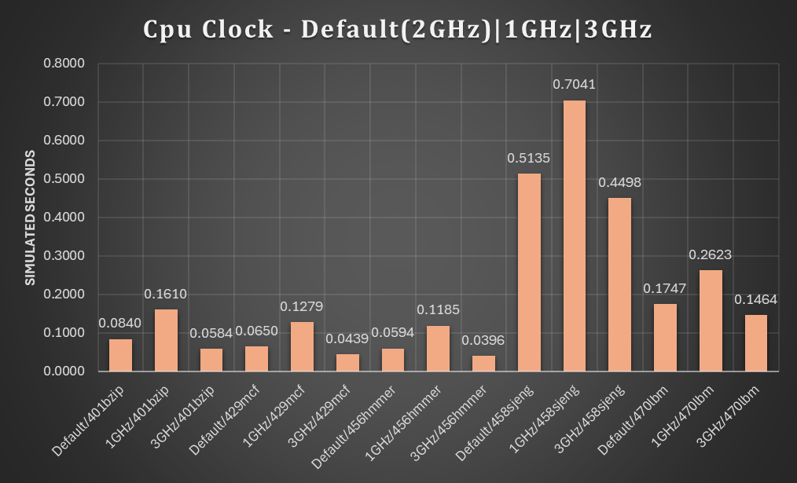
   Προφανώς δεν υπάρχει τέλειο **scaling**, συγκεκριμένα όταν υποδιπλασιάζουμε το ρολόι περίπου διπλασιάζεται ο χρόνος ενώ όταν διπλασιάσουμε το ρολόι τότε ο χρόνος μειώνεται περίπου κατα **20-30%**. Αυτό φυσικά διαφέρει σε κάθε benchmark. Αυτό συμβαίνει επειδή το χρόνο εκτέλεσης τον επηρεάζουν πολλές παράμετροι και όχι μόνο το ρολόι του επεξεργαστή. Υπάρχουν καθυστερήσεις μνήμης για παράδειγμα που καθυστερούν τον επεξεργαστή και δεν βελτιώνονται προφανώς αλλάζοντας το ρολόι του επεξεργαστή. 
   <a name=p2.s1.q1></a>
4. Εκτελούμε τα benchmarks για μνήμη **DDR3_2133**, ενώ η προηγούμενη τεχνολογία ήταν **DDR3_1600**. Τα αποτελέσματα φαίνονται παρακάτω:
   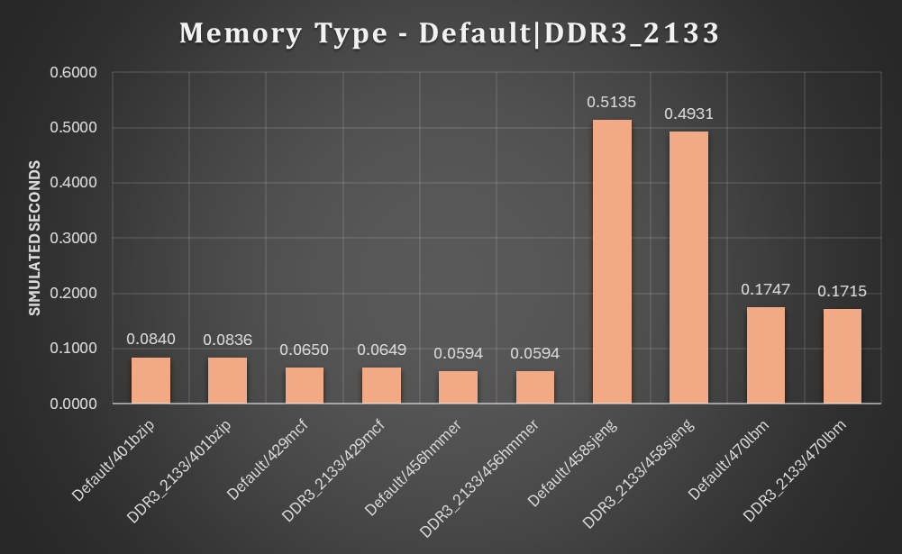
   Παρατηρούμε μια μικρή **μείωση** του χρόνου το οποίο είναι λογικό αφου ταχύτερη μνήμη σημαίνει **μικρότερες** **καθυστερήσεις**, κατι που είναι ιδιαίτερα σημαντικό ειδικά σε απαιτητικά προγράμματα. Στα υπόλοιπα δεδομένα δεν παρατηρούμε κάποια διαφορά και είναι λογικό για τα Cache misses αφού δεν επηρεάσαμε το μέγεθος της μνήμης.
### Βήμα δεύτερο
<a name=p2.s2.q1></a>
1. Η μέθοδος που αποφάσισα να ακολουθήσω είναι αρχικά να αλλάξω **ένα** **παράγοντα** κάθε φορά και να τρέξω όλα τα benchmarks, να συλλέξω τα δεδομένα και να δω τι μπορώ να παρατηρήσω από αυτα. Τα **αποτελέσματα** αυτά φαίνονται **παρακάτω** και συγκεκριμένα στο ερώτημα 2. Στην συνέχεια με ότι συμπέρασμα έβγαλα από αυτά και απο προηγούμενα αποτελέσματα κατέληξα σε κάποιους συνδυασμούς. Θεωρητικά είναι καλό να **αυξήσουμε** τα μεγέθη των **cache**, το **associativity** και το **cacheline** ώστε να μειώσουμε τον αριθμό των miss rate και άρα των καθυστερήσεων καθώς και σχετικά μεγάλη ταχύτητα ρολογιού και ταχύτητα μνήμης ώστε να ελαχιστοποιήσουμε τον χρόνο που απαιτούν οι καθυστερήσεις. Βέβαια το **μέγεθος** μίας μνήμης επηρεάζει και την **ταχύτητα** της οπότε θα ήταν καλό να κάνουμε κάποιες δοκιμές γι αυτό αν και τα δεδομένα έδειξαν ότι με την αύξηση της, ο χρόνος μειώνεται. Ακόμα το **associativity** φαίνεται να βοηθάει με το miss rate, όμως καθώς **αυξάνεται** η πολυπλοκότητα, αυξάνεται και ο **χρόνος** **πρόσβασης** στην μνήμη. Επίσης επειδή έχουμε συνολικό μέγεθος L1 Cache ισο με **256Kb**, πρέπει να κάνουμε κάποιες δοκιμές σχετικά με την κατανομή στην icache και dcache.  
   Μετά από έναν αριθμό προσομοιώσεων καταλήξαμε σε 5 τελικές όπου φαίνονται στο αρχείο excel [resultGraphs](resultGraphs.xlsx). Τελικά καταλήγουμε στην 3η η οποία κατα μέσο όρο βελτιστοποιεί τον επεξεργαστή για όλα τα benchmarks.  
   Οι τελικές επιλογές είναι:
   ``` 
   CPU Type	                MinorCPU  
   CPU Clock	                3GHz
   L1 Instruction Cache Size	32kB
   L1 Instruction Assoc	      4
   L1 Data Cache Size	        64kB
   L1 Data Assoc	              4
   L2 Cache Size	              4MB
   L2 Cache Assoc	              8
   Cache Line Size	              128B
   ```
   Παρατηρούμε ότι τελικά ότι κρατήσαμε **σταθερό** το μέγεθος της iCache αλλά **αυξήσαμε** το **associativity**. Το ίδιο συμβαίνει και με την **dCache**. **Αυξήσαμε** το μέγεθος της **L2** **Cache** και κρατήσαμε **σταθερό** το **associativity**. Τέλος **αυξήσαμε** το μέγεθος **Cacheline** στο οποίο παρατηρήσαμε σημαντική διαφόρα στα παρακάτω αποτελέσματα στο 2 ερώτημα.

   Και έχει τα εξής αποτελέσματα.

   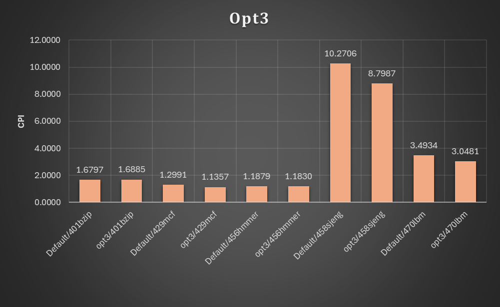
<a name=p2.s2.q2></a>
2. Στα επόμενα γραφήματα κάθε φορά αλλάζει μόνο ένας παράγοντας απο τις default ρυθμίσεις και θα παρατηρήσουμε πως μεταβάλλεται ο χρόνος του προγράμματος. Πέρα απο αυτό κάτω από κάθε φωτογραφία υπαρχουν σχόλια σχετικά με τον χρόνο και άλλες μετρικές που δεν φαίνονται στις εικόνες. Όλη η πληροφορία υπάρχει στο αρχείο excel [resultGraphs](resultGraphs.xlsx).
   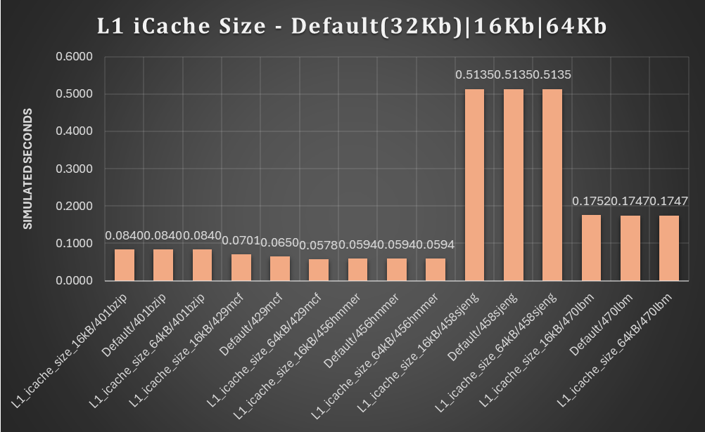
   Αυξάνοντας το μέγεθος της icache, τότε ο χρόνος μειώνεται καθώς η μεγαλύτερη cache επιτρέπει να αποθηκευτεί προσωρινά περισσότερη πληροφορία, άρα μειώνεται σημαντικα το iCache Miss Rate.
   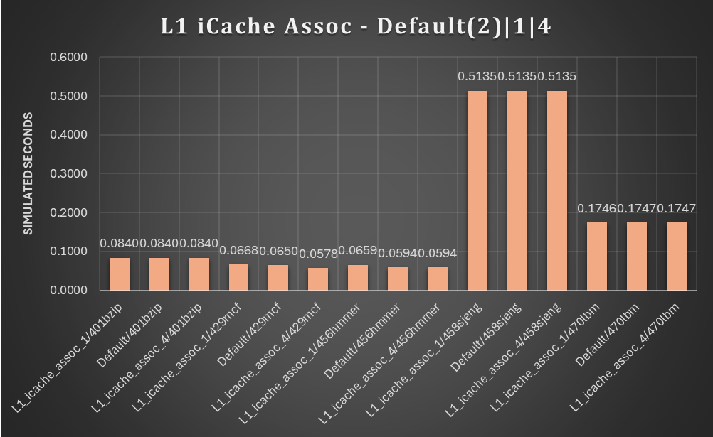
   Αυξάντοντας το associativity παρατηρούμε ότι ο χρόνος μειώνεται αφού πάλι μειώνεται το Miss Rate. Καθώς μεγαλώνει το associativity ένα block της cache μπορεί να αποθηκευτεί σε όσα σημεία λεει ο αριθμός. Αυτο βοηθάει στο να χρησιμοποιείται μεγαλύτερο μέρος της cache χωρίς να διώχνονται συνέχεια blocks που γίνονται overlapped.
   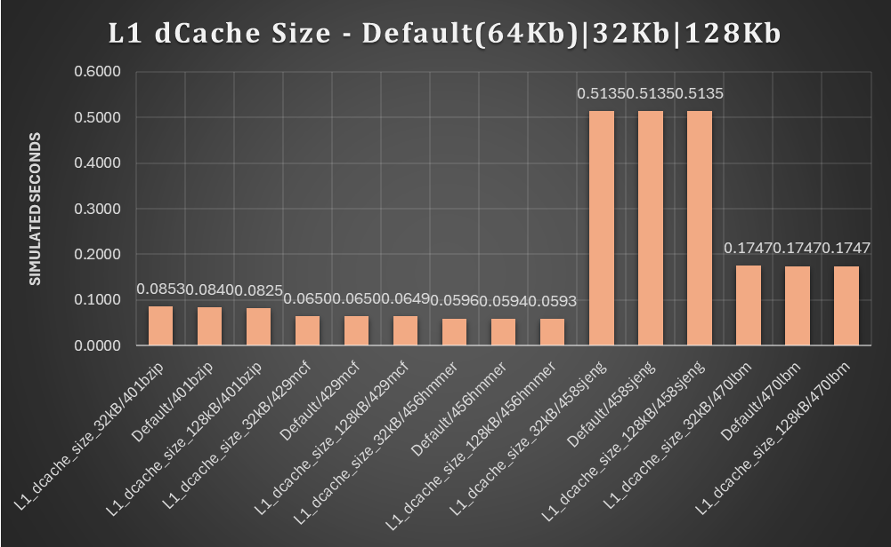
   Αντίστοιχα με το μέγεθος της icache, ετσι και στην dcache μείωνεται το Miss Rate καθώς αυξάνεται το μέγεθός της το οποίο έχει αντίκτυπο και στον χρόνο εκτέλεσης του προγράμματος.
   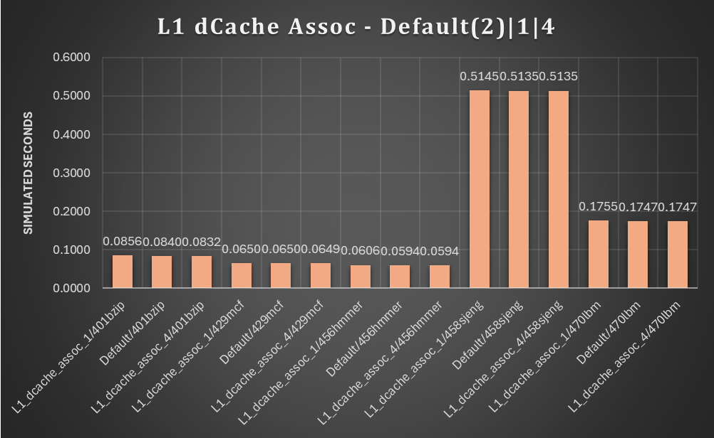
   Παρόμοια με την icache είναι και τα στοιχεία για το associativity στην dcache.
   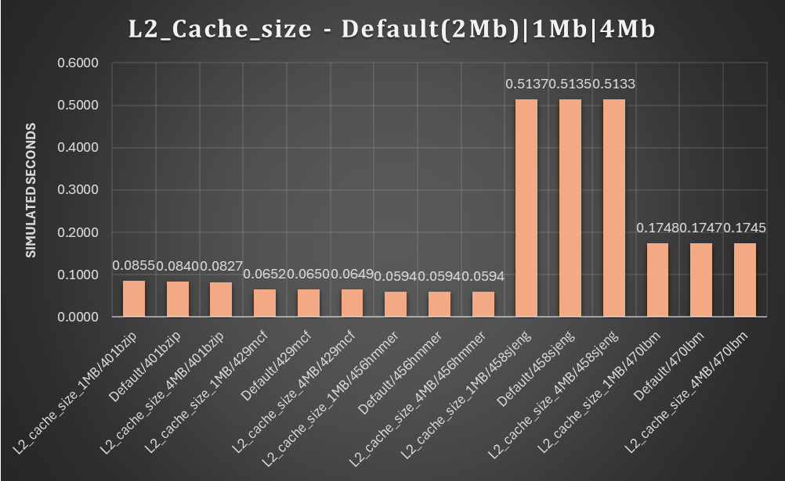
   Όπως και προηγουμένως, αυξάνοντας την Cache, στην συγκεκριμένη περίπτωση του 2ου επιπέδου, μειώνεται το Miss Rate, κάτι που έχει αντίκτυπο στον χρόνο του προγράμματος αφού μειώνεται ο αριθμός των καθυστερήσεων.
   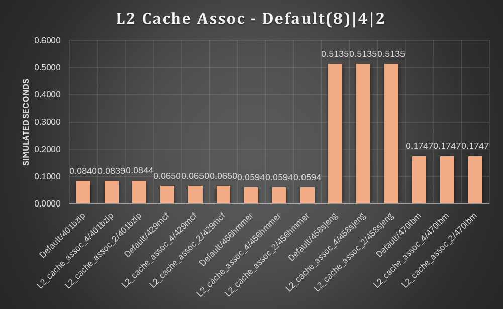
   Στην συγκεκριμένη περίπτωση, οι αλλαγές στο associativity δεν φαίνεται να μας βοήθησαν ιδιαίτερα στα benchmarks που τρέχουμε, πιθανόν επειδή ο τρόπος που υπάρχουν τα δεδομένα δεν κάνουν overlap το ένα block δεδομένων το άλλο.
   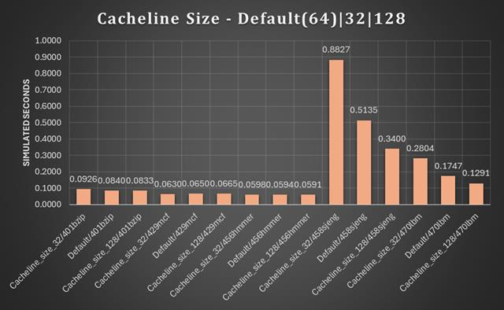  
   Τέλος το Cacheline είχε σημαντική βελτίωση ιδιαίτερα στα προγράμματα που είχαν μεγάλο χρόνο εκτέλεσης. Γενικότερα μειώνει το Miss Rate σε όλα τα επίπεδα cache καθώς καθε block στην cache είναι μεγαλύτερο επομένως έρχονται μαζί με τα χρήσιμα δεδομένα περισσότερα γειτονικά τους και με αυτό τον τρόπο αξιοποιείται καλύτερα η τοπικότητα τον προγραμμάτων.
### Βήμα τρίτο
#### Κόστος
Για να κατασκευάσουμε την συνάρτηση **κόστους** πρέπει να λάβουμε υπόψη τι πρέπει να **πληρώσουμε** για κάθε **επιλογή**. Έστω μια αυθαίρετη μόναδα κόστους.  
Θα ξεκινήσουμε ορίζοντας ως κόστος ενός **byte** της **L2** **Cache** την μονάδα. Τότε:
> $L2SizeCost = L2Bytes$

Βέβαια πρέπει να υπολογίσουμε και το complexity που εισάγει το **associativity** στην **L2** **Cache** το οποίο είναι ανάλογο των **associativity** **ways** και του κόστους της Cache. Επομένως:
> $L2AssociativityCost = L2SizeCost * \frac{L2AssocWays}{10}$


Αντίστοιχο σκεπτικό ακολουθούμε για την **L1** **Cache**. Βέβαια αυτή είναι αρκετά πιο **ακριβή** απο την Cache επιπέδου 2, σχεδόν μια τάξη μεγέθους ακριβότερη. Αυτό συμβαίνει επειδή πρέπει να είναι πολύ **γρήγορη** και σε μικρό μέγεθος για να είναι **κοντά** στον επεξεργαστή και αρκετά πιο **πολύπλοκη** για να υλοποιηθεί. Άρα για την **icache**:
> $L1iCacheSizeCost = 8 * L1iCacheBytes$

Το κόστος του **associativity** στην **L1** **Cache** είναι παρόμοιο αλλά μεγαλύτερο λόγω της φύσης της και της πολυπλοκότητας της:
> $L1iCacheAssociativityCost = L1iCacheSizeCost * 5 * \frac{L1iCacheAssocWays}{10}$

Η **dCache** είναι συνήθως λίγο πιο περίπλοκη από την iCache επειδή διαχειρίζεται και **εγγραφές** ενω η **iCache** κυρίως **ανάγνωση** και απαιτεί πιο πολύπλοκες διαδικασίες για συμβατότητα δεδομένων:
> $L1dCacheSizeCost = 8 * 1.4 * L1dCacheBytes$

Όσο αναφορά το κόστος του **associativity** είναι παρόμοιο με την icache:
> $L1dCacheAssociativityCost = L1dCacheSizeCost * 5 * \frac{L1iCacheAssocWays}{10}$

Τελευταία παράμετρος είναι το **Cacheline** **size**, το οποίο θα είναι **ανάλογο** του συνολικού **κόστους** της κάθε cache, αφού όσο περισσότερες γραμμές χωράνε σε μια cache τόσο πιο **πολύπλοκη** γίνεται. Η τάξη μεγέθους του κόστους αυτού υποθέτουμε ότι θα είναι παρόμοια με του **associativity** αφόυ και τα δύο επηρεάζουν την **πολυπλοκότητα** του κυκλώματος. Επομένως θα διαφέρει στην L1 και στην L2 Cache:
> $L1CachelineSizeCost = \frac{L1CacheSize}{CachelineSize} * \frac{5}{10000} * L1CacheCost$  

e.g. $L1CachelineSizeCost = \frac{96Kb}{128} * \frac{5}{10000} * L1CacheCost = 0.384 * L1CacheCost$ 


> $L2CachelineSizeCost = \frac{L2CacheSize}{CachelineSize*10000}*L2CacheCost$  

e.g. $L2CachelineSizeCost = \frac{1024Kb}{128*10000}*L2CacheCost = 0.8192 * L2CacheCost$ 


Άρα το **συνολικό** **κόστος** θα είναι αν αθροίσουμε όλα τα παραπάνω και κάνουμε τις αντικαταστάσεις:

> $ FinalCost = (8 * L1iCacheBytes * (1 + \frac{5}{10} *{AssocWays_{icache}}) + 8 * 1.4 * L1dCacheBytes * (1 + \frac{5}{10} *{AssocWays_{dcache}})) * (1 + \frac{L1CacheSize}{CachelineSize} * \frac{5}{10000}) + (L2Bytes * (1+\frac{AssocWays_{L2}}{10}) * (1 + \frac{L2CacheSize}{CachelineSize*10000}) $

#### Βελτιστοποίηση
Για να βρούμε την αρχιτεκτονική που **βελτιστοιποιεί** την απόδοση του συστήματος σε σχέση με το κόστος του θα χρησιμοποιήσουμε τον εξής λόγο:
>$ CostPerformanceRatio = \frac{Cost}{Performance} $

όπου το **Performance** είναι ανάλογο του $\frac{1}{CPI} $.  

Άρα τελικά:

>$ CostPerformanceRatio = Cost * CPI$

Και ψάχνουμε τον μικρότερο λόγο. 
```
                 opt1	       opt2	     opt3	      opt4	       opt5
401bzip	      *6894183	     26866974	     61502191	      50152998	  119217750
429mcf	      *4824820	     17801489	     41368112	      3698506	      81860054
456hmmer	*4321727	   18530987	   43089947	    35047486	85162850
458sjeng	*48904362   138093269   320489351	261442045   635537121
470lbm	      *15934560       47839308	     111028065	  90585871	  219793211
```
 
Οι μικρότεροι λόγοι που προκύπτουν για όλα τα benchmark είναι απο την αρχιτεκτονική **opt1** η οποία έβγαλε το **μικρότερο** κόστος. Αυτό είναι λογικό επειδή η τιμή του κόστους είναι πολύ μικρότερη σε σχέση με τα υπόλοιπα και στον λόγο η τιμή του κόστους είναι πολλές κλάσεις μεγαλύτερη απο το CPI και δεν έχουμε κάποια αναλογία βάρους ανάμεσα στις δύο τιμές. Επομένως επειδή υπάρχει τόσο μεγάλη **διαφορά** στο κόστος και πολύ μικρή διαφορά στο CPI που έχει το ίδιο βάρος με το κόστος, το τελευταίο καθορίζει το **αποτέλεσμα**.  
Φυσικά αυτο επηρεάζεται απο το τι μας ενδιαφέρει στη σχεδίαση μας. Στα πλαίσια της εργασίας για να έχουν περίπου την ίδια επίδραση θα **λογαριθμήσω** με βάση το **10** τα κόστη και επομένως θα προκύψουν οι εξής λόγοι:
```
          opt1	  opt2	  opt3	  opt4	  opt5
401bzip	  12.49	 *12.34	  12.77	  12.63	  12.99
429mcf	  8.74	 *8.18	  8.59	  8.49	  8.92
456hmmer *7.83	  8.51	  8.95	  8.83	  9.28
458sjeng  88.62	 *63.42	  66.53	  65.85	  69.26
470lbm	  28.88	 *21.97	  23.05	  22.82	  23.95
```
Σε αυτή την περίπτωση **βέλτιστη** λύση βγαίνει η 2 στα περισσότερα benchmark.


## Πηγές

- [Memory Types](https://nitish2112.github.io/post/gem5-memory-model/)
- [Using the default configuration scripts](https://www.gem5.org/documentation/learning_gem5/part1/example_configs/)
- [SimpleCPU](https://www.gem5.org/documentation/general_docs/cpu_models/SimpleCPU)
- [MinorCPU](https://www.gem5.org/documentation/general_docs/cpu_models/minor_cpu)
- [InOrderCPU](https://old.gem5.org/InOrder.html)
- [Understanding gem5 statistics and output
](https://www.gem5.org/documentation/learning_gem5/part1/gem5_stats/)
